# 💫 About Me

Hi, I'm Phong, a third-year Computer Science student at the University of Economics Ho Chi Minh City.

I am interested in Artificial Intelligence, Machine Learning, Deep Learning, Computer Vision, and Data Science. I enjoy building practical AI systems, working with real-world data, and exploring how machine learning models can be applied to solve meaningful problems.

Currently, I am focusing on:

- Computer Vision and medical image segmentation
- Deep Learning models for retinal vessel segmentation
- Graph Neural Networks for fraud detection
- Image processing and traditional segmentation techniques
- Data preprocessing, model evaluation, and experiment analysis

My current goal is to strengthen my foundation in AI/ML and prepare for AI/ML Engineer internship opportunities.

---

# 💻 Tech Stack

---

# 🚀 Featured Interests & Projects

- **Retinal Vessel Segmentation**  
  Applying traditional image processing, machine learning, and deep learning methods for medical image segmentation.

- **Deep Learning for Computer Vision**  
  Working with CNN-based and Transformer-based models such as DeepLabV3 and SegFormer.

- **Graph-based Fraud Detection**  
  Exploring graph representation learning and GNN-based approaches for transaction fraud detection.

- **Social Network Analysis**  
  Studying community detection, centrality, network diffusion, and epidemic intervention strategies.

- **Malicious HTTP Request Detection**  
  Building models and features to identify potentially malicious web requests.

---

# 🌐 Socials

---

## 📊 GitHub Stats

  
  

---

---

  

